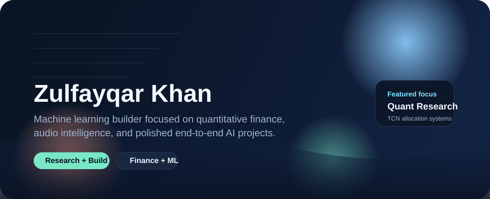
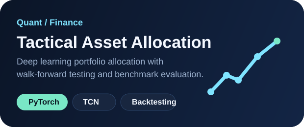

  

<h1 align="center">Zulfayqar Khan</h1>

  Machine Learning | Quantitative Finance | Audio Intelligence

  <a href="https://github.com/zulfayqar-khan?tab=repositories">Projects</a>
  |
  <a href="https://www.linkedin.com/in/your-linkedin-handle/">LinkedIn</a>
  |
  <a href="./assets/Zulfayqar_Khan_CV.pdf">CV</a>

  I build ambitious machine learning projects that combine research depth,
  practical engineering, and presentation that people can actually explore.

## About Me

I am especially interested in work that sits between strong technical thinking
and real-world usability.

- I build end-to-end machine learning systems, not just isolated models.
- I care about rigorous evaluation, meaningful baselines, and clear project storytelling.
- My strongest project themes so far are quantitative finance, time-series modeling, and music intelligence.
- I like turning technical work into something polished enough to function as a portfolio piece.

## Featured Work

<table>
  <tr>
    <td width="50%">
      <h3>Tactical Asset Allocation with TCNs</h3>
      

        A research-grade deep learning system for dynamic portfolio allocation
        across DJIA equities with walk-forward evaluation, transaction costs,
        leakage controls, and benchmark comparisons.
      

      

        <a href="https://github.com/zulfayqar-khan/tactical-asset-allocation-ai-project">Open repository</a>
      

    </td>
    <td width="50%">
      
    </td>
  </tr>
  <tr>
    <td width="50%">
      
    </td>
    <td width="50%">
      <h3>Music Mood Classifier</h3>
      

        A full machine learning pipeline that classifies Spotify tracks into
        broad musical categories using audio features, custom feature
        engineering, model comparison, and a Streamlit interface.
      

      

        <a href="https://github.com/zulfayqar-khan/music-mood-based-classifier-project">Open repository</a>
      

    </td>
  </tr>
</table>

## More Projects

- [Mood Classifier Project](https://github.com/zulfayqar-khan/mood-classifier-project)
- [Mood-Based Classifier](https://github.com/zulfayqar-khan/mood-based-classifier)

## What You Will Find Here

- Project work that spans finance, audio, and applied AI
- Repositories that emphasize both modeling and implementation
- A portfolio that is becoming more curated, intentional, and presentation-driven

## Current Direction

Right now I am focused on strengthening the bridge between research-grade ML
work and portfolio-quality execution. That means better experiments, better
documentation, and better ways for people to quickly understand what each
project actually does.

## Contact

- GitHub: [@zulfayqar-khan](https://github.com/zulfayqar-khan)
- LinkedIn: replace with your real profile URL
- CV: add your PDF as `assets/Zulfayqar_Khan_CV.pdf`
